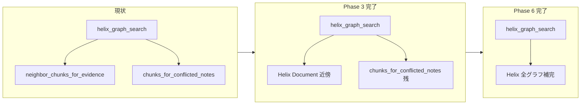

# Helix グラフ探索: mirror 依存のネイティブ化

本計画は `.agent/PLANS.md` に従って維持する生きた ExecPlan である。実装者は、進捗、発見、判断、結果をこのファイルへ追記し、現在の作業ツリーだけから再開できる状態を保つ。

前回の Phase 2 計画（[【完了】仕様ギャップ実装plan-phase2.md](【完了】仕様ギャップ実装plan-phase2.md)）完了時点で、Helix graph search の末尾が SQLite mirror 補完に依存している。本計画は **(1) Document 前後 Chunk** と **(2) 矛盾 note 経由の Entity 展開** の 2 点を Helix ネイティブへ移し、`helix_graph_search` から `mirror_sources` ブロックを完全に除去する。

## Purpose / Big Picture

仕様 §5.3 では「採用済み Evidence と同じ Document の前後 Chunk を探す」ことがグラフ探索の要件である。現状、Helix backend（`--backend helix`）でもこの探索は [`SQLiteRagStore.neighbor_chunks_for_evidence`](../src/state_aware_rag/store.py) を呼び出しており、Helix 上の `Document` / `Chunk` / `Evidence` グラフをたどっていない。

本変更後、利用者が `state-aware-rag ask` を Helix backend で実行したとき、グラフ探索候補の発見は Helix への read query だけで行われる。SQLite mirror は引き続き ID 復元と原文 body 表示に使うが、**候補 Chunk の発見ロジックは mirror に依存しない**。

開発者は `uv run pytest tests/test_helix_backend.py` で、送信される Helix query に Document 近傍・矛盾 Entity 展開用の traversal が含まれること、かつ `helix_graph_search` が `neighbor_chunks_for_evidence` / `chunks_for_conflicted_notes` を呼ばないことを確認できる。

## Progress

- [x] Phase 0: Helix DSL spike（traversal パターン確定）
- [x] Phase 1: Evidence に `working_memory_id` を Helix 同期
- [x] Phase 2: `helix_neighbor_chunks_for_evidence` 実装
- [x] Phase 3: `helix_graph_search` 統合・Document 近傍の mirror 除去
- [x] Phase 4: テスト更新（Document 近傍）
- [x] Phase 5: ドキュメント更新（中間）
- [x] Phase 6: 矛盾 note 経由 Entity 展開の Helix 化・`mirror_sources` 完全除去

## Surprises & Discoveries

- `Chunk.position` は Python の `Chunk` dataclass には無く、Helix query の projection row から読む必要があった。`_rows_to_candidates` と別に `_row_value` / `_row_int` を追加し、Helix の property wrapper とテスト用 flat row の両方を扱う。
- `link_note_entity` は `SQLiteRagStore.create_memory_note` 内で Helix note node 作成前に呼ばれるため、今回の同期は既存どおり `HelixBackedRagStore.create_memory_note` の後段で `RELATED_TO` を張る流れを維持した。

## Decision Log

- Decision: Phase 6 で `chunks_for_conflicted_notes` の mirror 補完も Helix ネイティブへ移す。既存の `CONFLICTS_WITH → SUPPORTED_BY → FROM_CHUNK` traversal に加え、矛盾当事 note の `RELATED_TO → Entity ← MENTIONS ← Chunk` を Helix query で足す。
  Rationale: Helix 経路だけだと SQLite 版の `entity_chunks` 展開が欠け、探索面が狭い。Document 近傍と同じ `helix_graph_search` ブロックでまとめて直す方が手戻りが少ない。
  Date/Author: 2026-06-17 / 計画更新（Phase 6 追加）

- Decision: SQLite mirror 自体は削除しない。body 原文の復元（`_rows_to_candidates` の mirror fallback）と型復元用途は維持する。
  Rationale: ADR-001 の方針どおり、Python 側 mirror は ID / 原文の正とする設計が既に定着している。
  Date/Author: 2026-06-17 / 計画策定

- Decision: （Phase 0 spike 後に確定）近傍探索の第一候補は `Evidence → FROM_CHUNK → Chunk → in(HAS_CHUNK) → Document → out(HAS_CHUNK) → Chunk` のグラフ traversal とする。DSL で position 範囲フィルタが難しい場合は、Helix から取得した sibling Chunk の `position` を Python 側で `abs(delta) <= 1` フィルタする。
  Rationale: 仕様 §5.3 の「同じ Document」はグラフ上の `HAS_CHUNK` 関係で表現されている。`Chunk.document_id` プロパティのみの lookup は fallback として残せるが、第一選択は traversal。
  Date/Author: 2026-06-17 / 計画策定（spike で覆る可能性あり）

- Decision: Document 近傍は `Evidence(working_memory_id) → FROM_CHUNK` で anchor を取得し、anchor ごとに `Chunk → in(HAS_CHUNK) → Document → out(HAS_CHUNK) → Chunk` を投げる。`position` 差分は Python 側で `abs(delta) <= 1` に絞る。
  Rationale: Helix DSL で anchor ごとの `position` 比較を 1 query に押し込まず、グラフ traversal とアプリ側フィルタを分ける方が既存 SDK とテスト fake の両方で安定する。
  Date/Author: 2026-06-17 / 実装

- Decision: （Phase 0 spike 後に確定）Helix 上の全 Evidence を WM 単位で引くため、`Evidence` ノードに `working_memory_id` プロパティを追加する。
  Rationale: 現状 Helix Evidence には `working_memory_id` がなく、SQLite のみ保持している。`SearchRound -RETURNED-> Evidence` だけではラウンドログ記録前の Evidence や、note 未紐付け Evidence を網羅できない。仕様どおり「採用済み Evidence すべて」から近傍を取るには WM 直結が最小変更。
  Date/Author: 2026-06-17 / 計画策定

- Decision: 矛盾 note 経由探索は outgoing / incoming の `CONFLICTS_WITH` を両方読む。各方向について `SUPPORTED_BY → FROM_CHUNK` と `RELATED_TO → in(MENTIONS)` を個別 read query とし、Python 側で chunk id dedupe する。
  Rationale: `add_conflict` 呼び出し順によって Helix edge の向きが変わっても、SQLite 版の探索面と同等にするため。
  Date/Author: 2026-06-17 / 実装

## Outcomes & Retrospective

- `HelixBackedRagStore.helix_graph_search` から `mirror_sources` ブロックを削除し、Document 近傍と矛盾 note 関連 Chunk の候補発見を Helix read query に移した。
- `Evidence` node に `working_memory_id` を同期するようにし、note 未紐付け Evidence も Document 近傍探索の anchor になる。
- `FakeHelixClient` を write request から node / edge を復元する形へ拡張し、`HAS_CHUNK` 近傍 query、note 未紐付け Evidence、`RELATED_TO` / `MENTIONS` による矛盾 Entity 展開をテストした。
- `PYTHONUTF8=1 UV_LINK_MODE=copy uv run pytest tests/test_helix_backend.py -q` は 13 件成功。
- `PYTHONUTF8=1 UV_LINK_MODE=copy uv run pytest -q` は 54 件成功（CUDA driver warning 1 件のみ）。

---

## 現状と目標

### 現状（問題）

[`HelixBackedRagStore.helix_graph_search`](../src/state_aware_rag/helix_store.py) の末尾:

```text
mirror_sources = [
    (self.neighbor_chunks_for_evidence(working_memory_id), "採用済み Evidence と同じ Document の前後 Chunk"),
    (self.chunks_for_conflicted_notes(working_memory_id), "矛盾の可能性がある MemoryNote 経由で発見"),
]
```

`neighbor_chunks_for_evidence` は SQLite 上で次を実行している:

```text
evidence (working_memory_id で全件)
  → anchor chunk (e.chunk_id)
  → same document_id の chunk n
  → ABS(n.position - anchor.position) <= 1
```

Helix 側では ingest 時に `Chunk.position` / `Chunk.document_id` / `Document -HAS_CHUNK-> Chunk` は既に書き込まれている（[`_add_chunk_node`](../src/state_aware_rag/helix_store.py)、[`ingest_document`](../src/state_aware_rag/helix_store.py)）。不足しているのは **(a) WM に紐づく Evidence の Helix 側引き方** と **(b) 近傍 Chunk を Helix query で取る経路** である。

### 目標（完了条件）

**Phase 3 完了時点（中間）:**

1. `helix_graph_search` が `neighbor_chunks_for_evidence` を呼ばない。
2. Document 近傍候補は Helix への `readBatch` query で取得する。
3. note 未紐付けの採用済み Evidence も近傍探索の anchor になる。

**Phase 6 完了時点（最終）:**

4. `helix_graph_search` が `chunks_for_conflicted_notes` を呼ばず、`mirror_sources` ブロック自体が存在しない。
5. 矛盾当事 MemoryNote の Entity 経由 Chunk 展開が Helix traversal で SQLite 経路と同等になる。
6. `uv run pytest` が全件成功し、Helix テストが送信 query を検証する。
7. README と仕様書 §5.3.1 の Helix 走査経路記述が実装と一致する。

### スコープ外

- `NEXT_CHUNK` / `PREV_CHUNK` エッジの新設（将来の最適化候補）
- SQLite backend（`--backend sqlite`）の `retrieval.graph_search` 変更（現状どおり SQLite/SQL で問題なし）
- SQLite mirror の廃止（原文表示・型復元は維持）



---

## Phase 0: Helix DSL spike

**目的:** 実装前に、近傍探索用の dynamic query が Helix 3.x で動くことを確認し、採用パターンを固定する。

**作業ディレクトリ:** リポジトリルート

**手順:**

1. 既存の ingest / ask フローで 3 chunk 以上の文書を Helix に入れる（または [`tests/test_helix_backend.py`](../tests/test_helix_backend.py) の `test_helix_graph_search_includes_neighbor_chunks` と同型のデータを手動再現）。
2. 次の 2 パターンを [`HelixHttpClient`](../src/state_aware_rag/helix.py) または `uv run python` ワンライナーで試す。

**パターン A（グラフ traversal・推奨）:**

```text
readBatch()
  .varAs("anchors",
    g().nWithLabel("Evidence")
      .where(Predicate.eqParam("working_memory_id", "wm_id"))
      .out("FROM_CHUNK")
      .project([
        PropertyProjection.new("id"),
        PropertyProjection.new("document_id"),
        PropertyProjection.new("position")
      ]))
  ...
```

anchor ごとに sibling を取る:

```text
g().nWithLabel("Chunk")
  .where(Predicate.eqParam("id", "anchor_id"))
  .in("HAS_CHUNK")
  .out("HAS_CHUNK")
  .project([id, body, source_uri, position, document_id])
```

**パターン B（プロパティ fallback）:**

```text
g().nWithLabel("Chunk")
  .where(Predicate.eqParam("document_id", "doc_id"))
  .project([...])
```

3. spike 結果を `Decision Log` に追記する。採用パターン、1 query で済むか複数 query か、position フィルタを Helix 側で書けるかを明記する。

**受け入れ:** spike 用 query が Helix dev サーバーでエラーなく返る、または FakeHelixClient 上で期待 JSON が組み立てられる。

---

## Phase 1: Evidence に `working_memory_id` を Helix 同期

**対象:** [`src/state_aware_rag/helix_store.py`](../src/state_aware_rag/helix_store.py)

**変更:**

1. [`_add_evidence_node`](../src/state_aware_rag/helix_store.py) の `defineParams` / `addN("Evidence", {...})` に `working_memory_id:param.string()` を追加する。
2. [`create_evidence`](../src/state_aware_rag/helix_store.py) オーバーライドで、SQLite 側と同じ `working_memory_id`（第 1 引数）を Helix へ渡す。

**既存データ:**

- 新規 ingest / ask だけ使う環境では再 ingest で足りる。
- 既存 Helix データを保持する環境では、任意の backfill を用意する（例: `scripts/backfill_helix_evidence_wm.py` が SQLite `evidence.working_memory_id` を読み Helix `Evidence` に `setProperty` する）。本番データがある場合は README に再 ingest または backfill の手順を 1 段落で記載する。

**受け入れ:** ingest + ask 後、Helix に送られる Evidence 作成 query の JSON に `working_memory_id` が含まれる（[`test_helix_backed_store_writes_required_graph_edges`](../tests/test_helix_backend.py) を拡張してもよい）。

---

## Phase 2: `helix_neighbor_chunks_for_evidence` 実装

**対象:** [`src/state_aware_rag/helix_store.py`](../src/state_aware_rag/helix_store.py)

**新規メソッド（案）:**

```python
def helix_neighbor_chunks_for_evidence(
    self, working_memory_id: str, top_k: int
) -> list[RetrievalCandidate]:
    ...
```

**アルゴリズム（Phase 0 で確定したパターンに従う）:**

1. Helix から `working_memory_id` に一致する `Evidence` をすべて取得する（`accepted` は SQLite 側で true のみ insert されているため、Helix も同様）。
2. 各 Evidence について anchor Chunk（`FROM_CHUNK` または spike で確定した traversal）を取得する。`document_id` と `position` を得る。
3. 同一 `document_id` の sibling Chunk を Helix から取得する（`HAS_CHUNK` traversal または `document_id` 条件）。
4. `abs(sibling.position - anchor.position) <= 1` でフィルタする。
5. `chunk_id` で dedupe し、`RetrievalCandidate` を組み立てる。
   - `method=RetrievalMethod.GRAPH`
   - `graph_reason="採用済み Evidence と同じ Document の前後 Chunk"`（既存文字列を維持しテスト互換を保つ）
   - `body` / `source_uri` は [`_rows_to_candidates`](../src/state_aware_rag/helix_store.py) 経由で mirror 原文に置き換えてよい（発見は Helix、表示は mirror の現行設計を維持）

**パフォーマンス:** anchor が複数ある場合、document_id ごとに 1 回 sibling query にまとめる。`top_k` は既存 `helix_graph_search` と同様、呼び出し元の残り枠に合わせて打ち切る。

**受け入れ:** Phase 0 の query パターンがメソッド内に閉じ込められ、単体で候補リストを返せる。

---

## Phase 3: `helix_graph_search` 統合

**対象:** [`src/state_aware_rag/helix_store.py`](../src/state_aware_rag/helix_store.py) の `helix_graph_search`

**変更:**

1. `mirror_sources` から `neighbor_chunks_for_evidence` のタプルのみ削除する（`chunks_for_conflicted_notes` は Phase 6 まで残す）。
2. CONFLICTS_WITH 探索の直後、残り `top_k` があれば `helix_neighbor_chunks_for_evidence(working_memory_id, remaining_k)` を呼ぶ。
3. 292–293 行付近のコメントを「Document 近傍は Helix 化済み。矛盾 Entity 展開は Phase 6」に更新する。

**変更してはいけないもの:**

- [`retrieval.py`](../src/state_aware_rag/retrieval.py) の SQLite 経路（`hasattr(helix_graph_search)` が false のときの `neighbor_chunks_for_evidence` / `chunks_for_conflicted_notes`）

**受け入れ:** `helix_graph_search` 内に `neighbor_chunks_for_evidence` 文字列が存在しない（grep で確認）。

---

## Phase 4: テスト

**対象:** [`tests/test_helix_backend.py`](../tests/test_helix_backend.py)

### 4-1. `FakeHelixClient` 拡張

近傍探索用の query を識別できるようにする。例:

- `working_memory_id` と `HAS_CHUNK`（または `document_id`）を含む request に対し、ingest 済み chunk id / position を返す
- 既存の `HAS_NOTE` だけのスタブ返却と衝突しないよう、マッチ条件を狭くする

### 4-2. `test_helix_graph_search_includes_neighbor_chunks` 更新

- 近傍候補が依然として返ることを assert（回帰）
- `fake.requests` に Document 近傍用の Helix query が含まれることを assert
- `neighbor_chunks_for_evidence` が呼ばれていないことは、実装後に `helix_graph_search` から SQLite メソッド呼び出しが無いことで間接的に担保（必要なら `monkeypatch` で `neighbor_chunks_for_evidence` が呼ばれたら fail）

### 4-3. 新規テスト: note 未紐付け Evidence

SQLite [`neighbor_chunks_for_evidence`](../src/state_aware_rag/store.py) は note リンク不要で WM 内の全 Evidence を見る。同等性のため:

1. Evidence だけ作成し `create_memory_note` は呼ばない
2. `helix_graph_search` で近傍候補が得られることを確認

### 4-4. 全体回帰

```bash
cd /home/smorce/env2/work/state_aware_rag
PYTHONUTF8=1 UV_LINK_MODE=copy uv run pytest -q
```

**受け入れ:** 52 件以上（新規テスト分増加）すべて成功。

---

## Phase 5: ドキュメント（中間）

Phase 3 完了時点のドキュメント更新。Phase 6 完了後に再度更新する。

**対象:**

- [`README.md`](../README.md) 94 行付近「SQLite mirror から補完」の Document 近傍に関する記述
- [`docs/completion-audit.md`](../docs/completion-audit.md) の残ギャップ欄（矛盾 Entity 展開は未完了として明記）
- [`docs/verification.md`](../docs/verification.md)
- [`docs/実用版 State-Aware RAG 仕様書.md`](../docs/実用版 State-Aware RAG 仕様書.md) §5.3.1（Phase 6 で最終整合）

**変更内容（中間）:**

- Document 近傍は Helix native traversal で取得する旨に書き換える
- 矛盾 Entity 展開は Phase 6 予定であることを 1 行記載する
- `working_memory_id` を Helix Evidence に追加したこと、既存データは再 ingest または backfill が必要な場合があることを記載する

---

## Phase 6: 矛盾 note 経由 Entity 展開の Helix 化

**目的:** SQLite [`chunks_for_conflicted_notes`](../src/state_aware_rag/store.py) と Helix 経路の探索面ギャップを埋め、`helix_graph_search` から `mirror_sources` を完全除去する。

### 6-1. 現状ギャップ

SQLite は矛盾当事の MemoryNote について次の 2 経路を union している:

```text
direct_chunks:
  conflicted note → note_evidence → evidence → chunk

entity_chunks:
  conflicted note → note_entities → chunk_entities → chunk
```

Helix にはすでに次がある（[`helix_graph_search`](../src/state_aware_rag/helix_store.py) 262–291 行）:

```text
WorkingMemory → HAS_NOTE → CONFLICTS_WITH → SUPPORTED_BY → FROM_CHUNK
```

これは **矛盾相手 note の Evidence 由来 Chunk** に相当する。不足しているのは **矛盾当事 note 自身の RELATED_TO → Entity ← MENTIONS ← Chunk**（`entity_chunks`）である。当事 note 自身の `SUPPORTED_BY → FROM_CHUNK` は別ステップ（242–260 行）と重なる場合があるが、SQLite 同等を保つため Phase 6 で明示的にカバーするか spike で要否を確定する。

### 6-2. 新規メソッド（案）

```python
def helix_chunks_for_conflicted_notes(
    self, working_memory_id: str, top_k: int
) -> list[RetrievalCandidate]:
    ...
```

**アルゴリズム（Phase 0 spike で traversal を確定）:**

1. `WorkingMemory` から `HAS_NOTE` で MemoryNote を辿り、`CONFLICTS_WITH` エッジを持つ note（当事・相手の両方向）を対象とする。
2. **経路 A（既存 traversal の整理）:** 矛盾相手 note → `SUPPORTED_BY` → `FROM_CHUNK` → Chunk。
3. **経路 B（新規）:** 矛盾当事 note → `RELATED_TO` → Entity（型付きラベル）→ `in("MENTIONS")` → Chunk。
4. `chunk_id` で dedupe し、`graph_reason="矛盾の可能性がある MemoryNote 経由で発見"`（既存文字列を維持）で `RetrievalCandidate` を返す。
5. `body` / `source_uri` は `_rows_to_candidates` の mirror fallback でよい。

**Helix query 例（経路 B・spike 用）:**

```text
readBatch()
  .varAs("chunks",
    g().nWithLabel("WorkingMemory").where(Predicate.eqParam("id", "wm_id"))
      .out("HAS_NOTE")
      .out("CONFLICTS_WITH")
      .out("RELATED_TO")
      .in("MENTIONS")
      .project([id, body, source_uri, position, document_id])
      .limit(params.k))
  .returning(["chunks"])
```

当事 note 側の `RELATED_TO` も必要なら、`.out("HAS_NOTE").where(… CONFLICTS_WITH を持つ …)` のフィルタ方針を spike で確定する。

### 6-3. `helix_graph_search` 統合（最終）

**対象:** [`src/state_aware_rag/helix_store.py`](../src/state_aware_rag/helix_store.py)

1. `mirror_sources` ブロック全体を削除する。
2. 既存の CONFLICTS_WITH traversal（262–291 行）と `helix_chunks_for_conflicted_notes` の責務が重複しないよう整理する。重複候補は `seen` set で dedupe 済みのため、query を 1 本にまとめられればまとめる（必須ではない）。
3. 残り `top_k` に応じて `helix_neighbor_chunks_for_evidence` と `helix_chunks_for_conflicted_notes` を呼ぶ順序は現行 `mirror_sources` 順（近傍 → 矛盾）を維持する。

**受け入れ:**

- `helix_graph_search` 内に `mirror_sources` / `neighbor_chunks_for_evidence` / `chunks_for_conflicted_notes` が存在しない（grep で確認）。
- SQLite 経路（`retrieval.graph_search`）は変更なし。

### 6-4. テスト

**対象:** [`tests/test_helix_backend.py`](../tests/test_helix_backend.py)、[`tests/test_state_aware_rag.py`](../tests/test_state_aware_rag.py) の `test_graph_search_includes_conflicted_note_chunks` を参考に Helix 版を追加または拡張。

1. 2 つの矛盾する MemoryNote と共通 Entity を持つフィクスチャを ingest する。
2. `helix_graph_search` が `graph_reason="矛盾の可能性がある MemoryNote 経由で発見"` の候補を返すことを確認する。
3. Entity 経由のみ到達できる Chunk が含まれることを確認する（direct evidence だけでは拾えないケースを作る）。
4. `fake.requests` に `RELATED_TO` と `MENTIONS`（または Phase 6 で確定した traversal）を含む query が送られることを確認する。
5. `monkeypatch` で `chunks_for_conflicted_notes` が呼ばれたら fail する。

### 6-5. ドキュメント（最終）

- [`README.md`](../README.md): mirror 補完の記述を削除し、Helix グラフ traversal 一覧に Document 近傍・矛盾 Entity 展開を明記する。
- [`docs/completion-audit.md`](../docs/completion-audit.md): 本ギャップを完了済みに更新する。
- [`docs/実用版 State-Aware RAG 仕様書.md`](../docs/実用版 State-Aware RAG 仕様書.md) §5.3.1 と整合確認する。

---

## 将来の最適化（本計画では実装しない）

ingest 時に隣接 Chunk へ `PREV_CHUNK` / `NEXT_CHUNK` エッジを張れば、近傍 query を 1 hop に短縮できる。ただしスキーマと仕様書 §4.2 のエッジ一覧に無いため、本計画では `position` プロパティ＋`HAS_CHUNK` を使う。

---

## 実装後の確認シナリオ（手動・任意）

HelixDB 起動済み環境で:

```bash
PYTHONUTF8=1 UV_LINK_MODE=copy uv run state-aware-rag \
  --db helix_mirror.sqlite3 ingest docs/sample.md
PYTHONUTF8=1 UV_LINK_MODE=copy uv run state-aware-rag \
  --db helix_mirror.sqlite3 ask "（sample に答えられる質問）" --llm local --bosun rule
```

`--llm local` は Helix 探索経路の検証に十分。Bosun native / llama-server は本変更の必須条件ではない。

成功の目安: ask が完了し、graph 由来候補に Document 近傍の `graph_reason` がログまたはデバッグ出力で確認できる（現 CLI は候補を直接出力しないため、pytest を主な受け入れとする）。

---

## 参照

- 仕様 §5.3 / §5.3.1 グラフ探索: [`docs/実用版 State-Aware RAG 仕様書.md`](../docs/実用版 State-Aware RAG 仕様書.md)
- 暫定実装の経緯: [【完了】01_仕様ギャップ実装plan.md](【完了】01_仕様ギャップ実装plan.md) Decision Log「Helix graph search の前後 Chunk 補完は SQLite mirror」
- Helix 統合方針: [`docs/adr-001-helixdb-python-integration.md`](../docs/adr-001-helixdb-python-integration.md)
