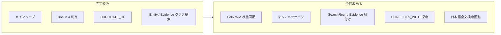

# 仕様ギャップ埋め込み計画（Phase 2）

本計画は `.agent/PLANS.md` に従って維持する生きた ExecPlan である。実装者は、進捗、発見、判断、結果をこのファイルへ追記し、現在の作業ツリーだけから再開できる状態を保つ。

前回の [【完了】01_仕様ギャップ実装plan.md](【完了】01_仕様ギャップ実装plan.md)（Phase 1–3）は完了済み（43 passed）。本計画は**残ギャップのみ**を対象とする。MCTS 本実装はスコープ外。

## Purpose / Big Picture

Phase 1 完了後も残っていた仕様監査ギャップを埋め、HelixDB 上の WorkingMemory 状態同期、§15.2 の失敗メッセージ、SearchRound と Evidence の正確な紐付け、CONFLICTS_WITH 起点グラフ探索、日本語全文検索（budoux 正規化）を実装する。利用者は Helix backend で ingest / ask したとき、日本語 query でも text search が機能し、ループ終了後の WorkingMemory status が Helix 側にも反映される。開発者は `uv run pytest` で各フェーズの回帰を確認できる。

## Progress

- [x] Phase 1: Helix WorkingMemory 状態同期
- [x] Phase 2: §15.2 失敗メッセージ
- [x] Phase 3: SearchRound → Evidence の正確な紐付け
- [x] Phase 4: CONFLICTS_WITH 起点グラフ探索
- [x] Phase 5: 日本語全文検索回避（budoux）
- [x] Phase 6: `WorkingMemoryStatus.FAILED`（低優先）
- [x] テスト追加とドキュメント更新

## Surprises & Discoveries

- budoux は短い複合語（例: `作業用メモ`）を 1 語のまま返す場合があるため、全文検索正規化では既知 suffix 分割と文字単位 fallback を追加した。
- Helix TypeScript query builder 後の JSON step 名は `setProperty` ではなく `SetProperty` として表現される。

## Decision Log

- Decision: duplicate shadow note は Phase 1 の意図的設計のまま維持し、本計画では変更しない。
  Rationale: `active_only` フィルタと `DUPLICATE_OF` エッジで仕様意図を満たしており、テスト済み。
  Date/Author: 2026-06-17 / 計画策定

- Decision: MCTS 本格実装はユーザー指示によりスコープ外。`MctsSearchStrategy` スタブは維持。
  Date/Author: 2026-06-17 / 計画策定

- Decision: 日本語全文検索は query と Helix index 対象 body の両方を `normalize_for_fulltext`（budoux）で正規化する。
  Rationale: query 側のみの対策では連続日本語 body に hit しない（`docs/verification.md` 記載の HelixDB 制約）。
  Date/Author: 2026-06-17 / 計画策定

- Decision: §15.2 メッセージ分岐はオーケストレータのみで行い、LLM 実装を二重化しない。
  Rationale: `LocalHeuristicLLM` と `JsonLlamaPlannerAndWriter` の両方に同じ判定を入れると保守コストが増える。
  Date/Author: 2026-06-17 / 計画策定

## Outcomes & Retrospective

（実装完了後に追記）

Phase 2 の対象ギャップを実装し、`uv run pytest` で `52 passed` を確認した。Helix `WorkingMemory` 同期、§15.2 固定メッセージ、`RoundLog.accepted_evidence_ids`、`CONFLICTS_WITH` 起点探索、日本語全文検索正規化、例外時 `FAILED` 更新を追加した。README / verification / completion-audit も更新済み。

## 現状と目標



| ギャップ | 優先度 | 方針 |
|---------|--------|------|
| Helix 上 WorkingMemory の status / round_count 未更新 | 高 | `HelixBackedRagStore.update_working_memory` を追加 |
| §15.2「根拠はあるがメモ化できない」未実装 | 高 | オーケストレータで終了時判定 |
| SearchRound → Evidence の誤リンク | 中 | `RoundLog` に evidence ID リストを持たせる |
| §5.3 CONFLICTS_WITH 起点グラフ探索なし | 中 | `store` + `retrieval` / `helix_store` に追加 |
| HelixDB 日本語全文検索制約 | 中 | ingest 時 body + 検索時 query を budoux 区切りに正規化 |
| `WorkingMemoryStatus.FAILED` 未使用 | 低 | オーケストレータ例外時のみ設定 |
| duplicate shadow note | — | **対応不要**（意図的設計・テスト済み） |
| `NoteStatus.CONFLICTED` 未使用 | — | **対応不要**（§6.4 は新規メモ active のまま） |
| Bosun プロンプト言語 | — | **対応不要**（Bosun XS reranker 形式準拠） |
| MCTS 本実装 | — | **ユーザー指示により除外** |

---

## Phase 1: Helix WorkingMemory 状態同期

**問題:** [`HelixBackedRagStore.create_working_memory`](../src/state_aware_rag/helix_store.py) は Helix に書き込むが、[`update_working_memory`](../src/state_aware_rag/store.py) のオーバーライドがなく、ループ後の `status` / `round_count` は SQLite mirror のみ更新される（§4.5・§18-3 の不完全点）。

**変更:**

1. [`helix_store.py`](../src/state_aware_rag/helix_store.py) に `update_working_memory` をオーバーライド
2. `super().update_working_memory(...)` で mirror 更新後、Helix へ `setProperty` で同期

Helix DSL パターン（vendor parity fixture 参照）:

```typescript
g().nWithLabel("WorkingMemory").where(Predicate.eqParam("id", "id"))
  .setProperty("status", PropertyInput.param("status"))
  .setProperty("round_count", PropertyInput.param("round_count"))
  .setProperty("updated_at", PropertyInput.param("updated_at"))
```

3. `round_count` 中間更新（[`orchestrator.py`](../src/state_aware_rag/orchestrator.py) L114, L155）でも Helix 同期が走ることをテストで確認

**テスト:** [`tests/test_helix_backend.py`](../tests/test_helix_backend.py) に `FakeHelixClient` で `setProperty` / `WorkingMemory` を含む query が発行されるケースを追加

---

## Phase 2: §15.2 失敗メッセージ

**問題:** [`LocalHeuristicLLM.generate_final_answer`](../src/state_aware_rag/llm.py) は active メモが空のとき常に §15.1（根拠なし）を返す。Evidence が存在するのにメモ化できなかったケースを区別していない。

**判定条件（機械的）:**

```text
accepted_evidence = store.list_evidence(wm.id) が非空
AND store.list_memory_notes(wm.id, active_only=True) が空
→ §15.2 メッセージ
```

**変更:**

1. [`text.py`](../src/state_aware_rag/text.py) または [`llm.py`](../src/state_aware_rag/llm.py) に定数・ヘルパを追加:

```python
MSG_NO_EVIDENCE = "検索結果が見つからなかったため、..."
MSG_DEMEMOIZATION_FAILED = "検索結果は見つかりましたが、質問に直接使える事実として整理できませんでした。"
```

2. [`orchestrator.py`](../src/state_aware_rag/orchestrator.py) の `generate_final_answer` 呼び出し前に上記判定。該当時は LLM を呼ばず固定文言を `AnswerResult.answer` に設定
3. **推奨: オーケストレータのみ**で分岐し LLM 二重実装を避ける

**テスト:** [`tests/test_state_aware_rag.py`](../tests/test_state_aware_rag.py) に「Evidence 作成後、全 duplicate で active note 0」のケース、または mock で `create_atomic_notes` が空 notes を返すケース

---

## Phase 3: SearchRound → Evidence の正確な紐付け

**問題:** [`helix_store.record_round_log`](../src/state_aware_rag/helix_store.py) L143–144 が `list_evidence(wm_id)[-N:]` を使い、複数ラウンド時に他ラウンドの Evidence が `RETURNED` に紐づく可能性がある。

**変更:**

1. [`RoundLog`](../src/state_aware_rag/models.py) に `accepted_evidence_ids: list[str] = field(default_factory=list)` を追加
2. [`orchestrator._record_log`](../src/state_aware_rag/orchestrator.py) で `accepted_evidence_ids=[ev.id for ev in evidence]` を設定（既に `evidence` 引数を受け取っている）
3. [`helix_store.record_round_log`](../src/state_aware_rag/helix_store.py) で ID リストを直接 `RETURNED` エッジに使用
4. SQLite `record_round_log` の JSON payload にも `accepted_evidence_ids` を追加（ログ完全性）

**テスト:** 2 ラウンド分の evidence を作り、round 1 の log に round 1 の ID のみが紐づくことを `FakeHelixClient` で検証

---

## Phase 4: CONFLICTS_WITH 起点グラフ探索（§5.3）

**問題:** [`Retriever.graph_search`](../src/state_aware_rag/retrieval.py) は Entity 経由と Evidence 近傍のみ。仕様 §5.3 の「CONFLICTS_WITH の可能性がある Note を探す」が未実装。

**変更:**

1. [`store.py`](../src/state_aware_rag/store.py) に `chunks_for_conflicted_notes(working_memory_id: str) -> list[Chunk]` を追加
   - `conflicts` テーブル → 関連 MemoryNote → `note_evidence` → Evidence → Chunk
   - 矛盾 Note の `RELATED_TO` Entity 経由 Chunk も含める（既存 `entities_for_memory` の拡張でも可）
2. [`retrieval.py`](../src/state_aware_rag/retrieval.py) の `graph_search` で `chunks_for_conflicted_notes` を `chunks.extend(...)` し、`graph_reason` を `"矛盾の可能性がある MemoryNote 経由で発見"` に設定
3. [`helix_store.helix_graph_search`](../src/state_aware_rag/helix_store.py) に Helix traversal を追加:

```text
WorkingMemory -HAS_NOTE-> MemoryNote -CONFLICTS_WITH-> MemoryNote -SUPPORTED_BY-> Evidence -FROM_CHUNK-> Chunk
```

   - 失敗時は SQLite mirror の `chunks_for_conflicted_notes` にフォールバック（neighbor chunks と同様のパターン）

**テスト:**

- SQLite: conflict エッジ作成後 `graph_search` が関連 Chunk を返す
- Helix fake: `CONFLICTS_WITH` を含む query が発行される

---

## Phase 5: 日本語全文検索回避（budoux）

**問題:** HelixDB の text index は連続日本語を tokenize しない（[verification.md](../docs/verification.md) 記載）。query 側だけの対策では body 側が未分割のままなので hit しない。

**方針:** query と index 対象の両方を同じ正規化関数で処理する。

**変更:**

1. [`text.py`](../src/state_aware_rag/text.py) に `normalize_for_fulltext(text: str) -> str` を追加
   - 日本語を含む場合: 既存 [`chunking.py`](../src/state_aware_rag/chunking.py) と同様に `budoux.load_default_japanese_parser()` で文節分割しスペース結合
   - 英数字・既存スペースは `tokenize` ベースで維持
   - budoux 未インストール時は現状どおり（`chunking` と同じ ImportError 扱い）

2. **検索時:** [`Retriever.text_search`](../src/state_aware_rag/retrieval.py) の入口で `normalize_for_fulltext(query_text)` を適用（Helix / SQLite 両方）

3. **取り込み時（Helix のみ）:** [`HelixBackedRagStore._add_chunk_node`](../src/state_aware_rag/helix_store.py) で Helix に書く `body` プロパティを `normalize_for_fulltext(chunk.body)` にする
   - SQLite mirror は原文 `chunk.body` を保持（表示・ベクトル検索用）
   - 既存 ingest 済みデータは再 ingest が必要（README / verification に 1 行追記）

4. **オプション:** `RagConfig.fulltext_normalize: bool = True` で無効化可能にし、テストの後方互換を確保

**テスト:**

- `normalize_for_fulltext("作業用メモ")` → スペース区切りになること
- `FakeHelixClient` で ingest 後の Chunk body が正規化されていること
- 正規化 query で `helix_text_search` が hit すること（fake または統合 stub）

---

## Phase 6（低優先）: `WorkingMemoryStatus.FAILED`

**方針:** 前回計画どおり CLI 起動失敗は `FAILED` にしない。オーケストレータ内の未処理例外のみ。

**変更:**

1. [`orchestrator.answer`](../src/state_aware_rag/orchestrator.py) を try/except で囲み、例外時に `update_working_memory(..., status=FAILED)` して再 raise
2. [`cli.py`](../src/state_aware_rag/cli.py) は既存どおり非 0 終了

**テスト:** store を意図的に壊すのではなく、`_save_notes` を patch して例外 → status が `failed` になることを確認

---

## 実装順序

```text
Phase 1 (Helix WM) ──┐
Phase 2 (§15.2)     ──┼─> 独立並行可能
Phase 3 (RoundLog)  ──┘
         │
         v
Phase 4 (CONFLICTS graph) ──> Phase 5 (日本語 text) と並行可
         │
         v
Phase 6 (FAILED) ──> 任意・最後
```

推奨コミット単位: Phase 1 / Phase 2+3 / Phase 4 / Phase 5 / Phase 6

---

## ドキュメント更新

- [`README.md`](../README.md): 日本語全文検索の budoux 正規化、再 ingest 要件を 1–2 行
- [`docs/verification.md`](../docs/verification.md): Phase 1–5 の検証手順と期待結果
- [`docs/completion-audit.md`](../docs/completion-audit.md): 残ギャップ解消後に更新

---

## テスト計画（追加）

| テスト | 検証 |
|--------|------|
| `test_helix_update_working_memory_syncs_status` | Helix query に setProperty |
| `test_answer_dememoization_failed_message` | Evidence あり・active note なし → §15.2 |
| `test_search_round_links_exact_evidence_ids` | 2 ラウンドで ID 混在なし |
| `test_graph_search_includes_conflicted_note_chunks` | conflict 経由 Chunk |
| `test_normalize_for_fulltext_japanese` | budoux 区切り |
| `test_helix_ingest_normalizes_chunk_body_for_text_index` | Helix body 正規化 |

既存 43 テストは全パス維持。`uv run pytest` で回帰確認。

---

## Plan Revision Note

2026-06-17: Phase 1 完了後のコード監査に基づき、残ギャップを Phase 2 として本ファイルに起票した。MCTS 本実装はユーザー指示により除外。日本語全文検索は budoux による query / Helix body 両方正規化を含める。
