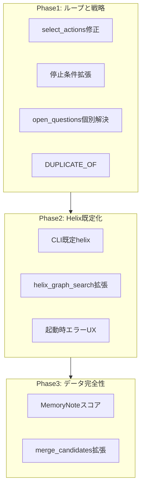

# 仕様ギャップ埋め込み実装計画

## 現状と目標

前回監査で未達だった主要項目:

| ギャップ | 優先度 |
|---------|--------|
| CLI 既定が SQLite（Helix 未既定） | 高（ユーザー選択） |
| `DUPLICATE_OF` エッジ未作成 | 高 |
| `select_actions()` が `score_action()` 未使用 | 高 |
| `open_questions` 空での停止（§11.4）未実装 | 中 |
| `resolve_open_questions()` が一括解決 | 中 |
| Helix グラフ探索に Document 前後 Chunk 補完なし | 高 |
| MemoryNote の Bosun 由来スコア未反映 | 低 |
| `vector_rank` / `text_rank` 未保持 | 低 |
| MCTS 本格実装 | 見送り |



---

## Phase 1: オーケストレータと検索戦略の仕様準拠

### 1-1. `select_actions` で `score_action` を使う

**対象:** [`src/state_aware_rag/strategy.py`](src/state_aware_rag/strategy.py), [`src/state_aware_rag/orchestrator.py`](src/state_aware_rag/orchestrator.py)

現状 `select_actions` は `expected_gain`（常に 1.0）だけでソートしている:

```56:57:src/state_aware_rag/strategy.py
    def select_actions(self, actions: list[SearchAction], budget: SearchBudget) -> list[SearchAction]:
        return sorted(actions, key=lambda action: action.expected_gain, reverse=True)[: budget.max_actions]
```

**変更内容:**
- `SearchStrategy` Protocol の `select_actions` に `state: SearchState` を追加
- `SocraticSearchStrategy.select_actions` を `score_action(a, state)` 降順ソートに変更
- `orchestrator.answer()` の呼び出しを `select_actions(actions, budget, state)` に更新
- `propose_next_actions` 内で `expected_gain` を LLM の `priority` から設定（任意・小改善）

**テスト:** [`tests/test_state_aware_rag.py`](tests/test_state_aware_rag.py) に、同一 priority でも `previous_queries` との重複が多い action が選ばれにくいことを検証するケースを追加

---

### 1-2. 停止条件の拡充（§11.4, §11.5）

**対象:** [`src/state_aware_rag/orchestrator.py`](src/state_aware_rag/orchestrator.py)

`_stop_status()` を拡張し、仕様の優先度に従う:

```text
1. stopped_by_no_new_notes  (既存)
2. stopped_by_low_gain      (既存: gain<=0 連続 + Evidence 0 件ラウンド)
3. stopped_by_max_rounds    (既存)
4. completed                (新規: active メモが1件以上 かつ 未解決 open_questions が 0)
```

**実装方針:**
- `_stop_status(round_number, no_new_note_rounds, low_gain_rounds, *, open_question_count, active_note_count)` に引数追加
- 各ラウンド終了時・Evidence 0 件時の両方で呼び出す
- §11.4 は「他の機械的停止より優先度を下げる」ため、上記 1–3 が該当しない場合のみ `COMPLETED` を返す
- §11.5（全候補低スコア 2 連続）は現状 `accepted_evidence` 空で `low_gain_rounds` を増やす処理と実質同等。コメントで意図を明示し、別カウンタは不要

---

### 1-3. `open_questions` の個別解決

**対象:** [`src/state_aware_rag/store.py`](src/state_aware_rag/store.py), [`src/state_aware_rag/orchestrator.py`](src/state_aware_rag/orchestrator.py)

現状は新規メモが 1 件でも入ると全 open_questions を resolved にする:

```116:117:src/state_aware_rag/orchestrator.py
            if accepted_count > 0:
                self.store.resolve_open_questions(wm.id)
```

**変更内容:**
- `resolve_open_question(working_memory_id, question: str)` を追加（1 件だけ resolved）
- atomic note 作成後、新規メモの `claim` と open_question の文字列重複（`normalize_claim` + `overlap_score`）でマッチしたものだけ解決
- 一括 `resolve_open_questions` はテスト用途に残すか、内部専用に縮小

---

### 1-4. `DUPLICATE_OF` エッジと duplicate ステータス

**対象:** [`src/state_aware_rag/orchestrator.py`](src/state_aware_rag/orchestrator.py), [`src/state_aware_rag/store.py`](src/state_aware_rag/store.py), [`src/state_aware_rag/helix_store.py`](src/state_aware_rag/helix_store.py)

仕様 §4.2 / §6.3 では重複時に新規 active メモを作らず、既存メモの evidence を増やす。グラフ上は `DUPLICATE_OF` エッジが必要。

**変更内容:**
1. `create_memory_note(..., status: NoteStatus = ACTIVE)` に `status` 引数を追加
2. `_save_notes` の重複分岐で:
   - `status=DUPLICATE` の shadow note を作成（`claim` は新規主張、`active_only` フィルタで最終回答から除外 — 既存の `list_memory_notes(active_only=True)` で満たせる）
   - `add_duplicate_edge(shadow.id, canonical.id, score)` を呼ぶ（SQLite `duplicate_edges` テーブル）
   - 既存の `merge_duplicate_note(canonical.id, evidence_ids, score)` は維持
3. [`HelixBackedRagStore.merge_duplicate_note`](src/state_aware_rag/helix_store.py) をオーバーライドし、`DUPLICATE_OF` エッジを `_link_nodes("MemoryNote", shadow_id, "DUPLICATE_OF", "MemoryNote", canonical_id, {"score": ...})` で張る
   - shadow note 作成は `create_memory_note` オーバーライド経由で Helix にも書き込まれる

**テスト:**
- SQLite: 重複後に `duplicate_edges` 行が存在すること
- Helix: [`tests/test_helix_backend.py`](tests/test_helix_backend.py) の `FakeHelixClient` リクエストに `DUPLICATE_OF` が含まれること

---

## Phase 2: HelixDB を主ストアとして整備

### 2-1. CLI 既定 backend を `helix` に変更

**対象:** [`src/state_aware_rag/cli.py`](src/state_aware_rag/cli.py), [`README.md`](README.md), [`docs/verification.md`](docs/verification.md)

```python
# cli.py
parser.add_argument("--backend", choices=["sqlite", "helix"], default="helix")
```

- README の使用例を Helix 前提の順序に並べ替え
- `--backend sqlite` は開発・CI 用フォールバックとして明記
- 既存テストは `SQLiteRagStore` を直接使うため影響なし。CLI 統合テストがあれば `--backend sqlite` を明示

---

### 2-2. Helix グラフ探索に Document 前後 Chunk 補完を追加

**対象:** [`src/state_aware_rag/helix_store.py`](src/state_aware_rag/helix_store.py) の `helix_graph_search`

SQLite 経路は [`retrieval.py`](src/state_aware_rag/retrieval.py) が `neighbor_chunks_for_evidence()` を呼んでいるが、Helix 経路は Entity `MENTIONS` と Evidence→Chunk のみ。

**変更内容（最小差分）:**
- `HelixBackedRagStore` は SQLite mirror を保持しているため、`helix_graph_search` の末尾で `self.neighbor_chunks_for_evidence(working_memory_id)` を呼び、mirror 上の `position` 近傍 Chunk を候補にマージ
- `graph_reason` を `"採用済み Evidence と同じ Document の前後 Chunk"` に設定
- 将来 Helix ネイティブ traversal に置き換え可能なよう、コメントで mirror 依存を明記

**テスト:** `FakeHelixClient` を使い、ingest → evidence 作成後の `helix_graph_search` で neighbor chunk が返るケースを追加（mirror 経由）

---

### 2-3. Helix 未起動時の UX

**対象:** [`src/state_aware_rag/cli.py`](src/state_aware_rag/cli.py), [`src/state_aware_rag/helix.py`](src/state_aware_rag/helix.py)

`HelixHttpClient.query` は `RuntimeError` を投げる。CLI の `_build_store` で helix 選択時に:

- `ingest` / `ask` 実行前の接続チェック（軽量 read クエリ or health）を追加
- 失敗時は英語エラーメッセージ + Helix 起動手順（README 参照）を表示して exit code 非 0

`WorkingMemoryStatus.FAILED` はここでは使わず、CLI レイヤで早期終了（オーケストレータまで到達しない失敗）。

---

## Phase 3: データモデル完全性（低優先・小さな差分）

### 3-1. MemoryNote スコアの Evidence 由来反映

**対象:** [`src/state_aware_rag/orchestrator.py`](src/state_aware_rag/orchestrator.py) `_save_notes`, [`src/state_aware_rag/store.py`](src/state_aware_rag/store.py)

`create_memory_note` 呼び出し時に、紐づく Evidence の平均から設定:

- `support_score` = 紐づく evidence の `memory_value_score` 平均
- `relevance_score` = 紐づく evidence の `relevance_score` 平均
- `novelty_score` = `1.0 - max(duplicate_score候補)` または固定 1.0（新規メモ時）

Evidence ID からスコアを引くヘルパ `store.get_evidence(evidence_id)` を利用。

---

### 3-2. 候補統合の `vector_rank` / `text_rank`

**対象:** [`src/state_aware_rag/models.py`](src/state_aware_rag/models.py), [`src/state_aware_rag/retrieval.py`](src/state_aware_rag/retrieval.py)

`RetrievalCandidate` にオプショナルフィールド `vector_rank: int | None`, `text_rank: int | None` を追加。`merge_candidates` で method ごとに rank を保持。オーケストレータのロジック変更は不要（ログ・将来 MCTS 用）。

---

## 見送り（今回スコープ外）

| 項目 | 理由 |
|------|------|
| `MctsSearchStrategy` 本格実装 | ユーザー選択。スタブは [`strategy.py`](src/state_aware_rag/strategy.py) に残し、ADR または仕様書メモで「Phase 2 以降」と記載 |
| SQLite に Question / SearchRound ノード | Helix 既定化により主データは Helix 側。mirror は ID 復元用のまま |
| 既定 embedder / Bosun の変更 | 現状で仕様充足 |

---

## 実装順序と依存関係

```text
Phase 1-1 (strategy)     ─┐
Phase 1-2 (stop)         ─┼─> 独立並行可能
Phase 1-3 (open_q)       ─┤
Phase 1-4 (duplicate)    ─┘
         │
         v
Phase 2-2 (helix graph)  ─> Phase 2-1 (CLI default) と並行可
Phase 2-3 (helix UX)
         │
         v
Phase 3-1, 3-2           ─> 任意・最後
```

推奨コミット単位: Phase 1 を 2–3 コミット（strategy+stop / open_q+duplicate）、Phase 2 を 1 コミット、Phase 3 を 1 コミット。

---

## テスト計画

| 追加テスト | 検証内容 |
|-----------|---------|
| `test_select_actions_penalizes_repeated_queries` | `score_action` が選定に効く |
| `test_stops_when_open_questions_resolved` | active メモあり + open_q 空で `COMPLETED` |
| `test_resolve_open_question_matches_claim` | 個別解決のみ |
| `test_duplicate_creates_duplicate_of_edge` | SQLite + Helix fake |
| `test_helix_graph_search_includes_neighbor_chunks` | mirror 経由の前後 Chunk |
| 既存 35 テスト | 全パス維持（`--backend sqlite` 明示の CLI テストがあれば更新） |

---

## ドキュメント更新

- [`README.md`](README.md): 既定 `helix`、SQLite フォールバック、起動前提
- [`docs/verification.md`](docs/verification.md): 検証手順を Helix 既定に合わせて更新
- 仕様書 §16 の MCTS 行に「スタブのみ・本格実装は将来」と注記（任意・1 行）
